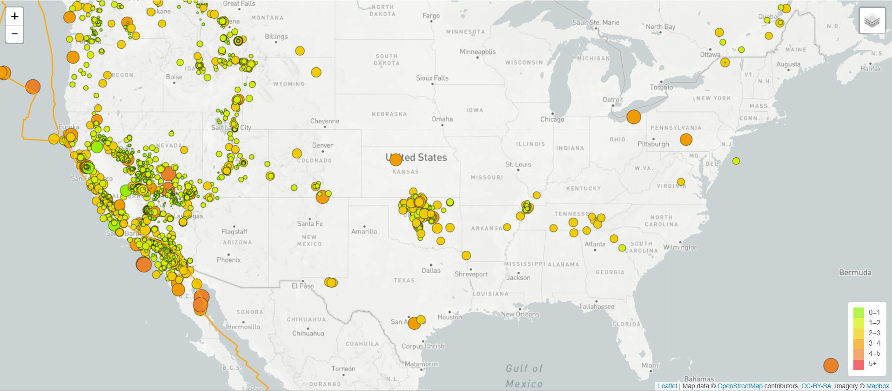
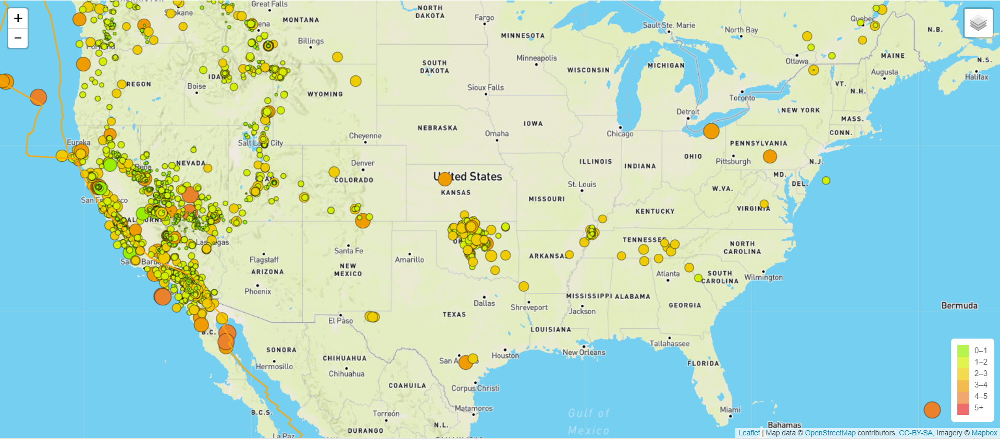

# Visualizing Earthquake Data with Leaflet

In this project, visualizations have been created using earthquakes data that occur globally using a live API feed provided by the USGS (United States Geological Survey). The data in the feed is updated every 5 mins, and includes all earthquake data for the past month. Additional layer of tectonic plates has been created to understand the relationship between tectonic plates and seismic activites.

### Web application:
* https://contactgokul.github.io/Visualizing-Data-with-Leaflet/

#### Technologies used for deveoping this Application:
* leaflet.js
* HTML/CSS/Bootstrap/Javascript
* GeoJSON

#### Data Sources used :
* https://earthquake.usgs.gov/earthquakes/feed/v1.0/geojson.php
* https://earthquake.usgs.gov/earthquakes/feed/v1.0/summary/all_month.geojson
* https://raw.githubusercontent.com/fraxen/tectonicplates/master/GeoJSON/PB2002_boundaries.json

#### Visuals created in this Application

### Author

Gokul Selvam Sadasivam@2019